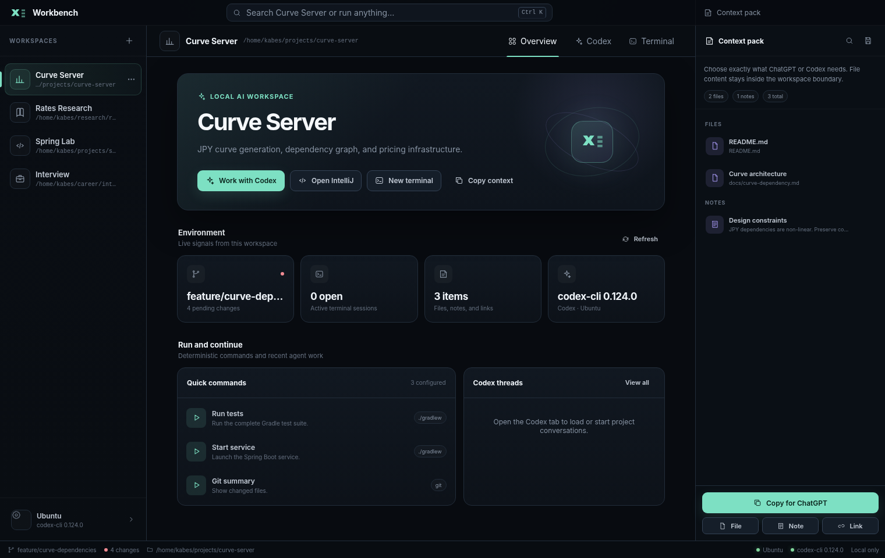

# Workbench

**Workbench is a free, local desktop control center for people who use ChatGPT and Codex heavily.**

It does not add another paid AI provider and it does not replace IntelliJ, ChatGPT, Git, or WSL. It organizes them around persistent workspaces and exposes Codex as a native desktop experience rather than a terminal-only process.

> Status: usable MVP for Windows + WSL. The project is intentionally local-first and single-user.



## What is included

- Persistent workspaces for code, research, interview preparation, or any WSL directory
- A polished dashboard with live Git, WSL, Codex, context, and terminal status
- Native Codex threads through `codex app-server`
- Workspace-level Codex model and reasoning-effort selection with remaining primary usage shown in the app
- Streaming agent messages, plans, shell output, diffs, reviews, and approval requests
- A GUI task queue backed by `AGENTS.md`, `TASKS.md`, and `WORKBENCH_PROGRESS.md`
- Embedded persistent WSL shells, with a direct-process fallback when the experimental Codex PTY API is unavailable
- Reusable workspace commands such as `./gradlew test`, `jupyter lab`, or `git status --short`
- A context tray containing files, notes, and links
- One-click Markdown context packs for pasting into ChatGPT
- IntelliJ and Windows Explorer launch actions
- A global in-app command palette with `Ctrl+K`
- No OpenAI API key and no additional AI subscription

## Requirements

- Windows 11 or a recent Windows 10 build
- WSL 2 with at least one Linux distribution
- Node.js 22 or newer on **Windows**
- Codex CLI installed and authenticated inside the selected WSL distribution
- IntelliJ IDEA is optional; its executable can be configured in Settings

Confirm Codex from WSL first:

```powershell
wsl.exe -d Ubuntu -- bash -lic "codex --version"
```

Replace `Ubuntu` with the distribution name shown by `wsl.exe --list --verbose`.

## Set up

Extract the project into a normal Windows folder, open PowerShell there, and run:

```powershell
powershell -ExecutionPolicy Bypass -File .\setup.ps1
```

Then launch it with:

```powershell
powershell -ExecutionPolicy Bypass -File .\run.ps1
```

The equivalent npm commands are:

```powershell
npm install
npm run check
npm run build
npm start
```

Create a Windows installer with:

```powershell
npm run dist:win
```

The installer is written to `release/`.

## First workspace

Choose **New workspace** and enter:

- **Name:** a short human-friendly name
- **WSL distribution:** for example `Ubuntu`
- **Linux project root:** an absolute path such as `/home/kabes/projects/curve-server`
- **Quick commands:** one command per line, using this format:

```text
Run tests :: ./gradlew test :: Complete Gradle test suite
Start service :: ./gradlew bootRun :: Launch the Spring Boot service
Git summary :: git status --short
```

A workspace can also point to a research or study folder; it does not need to be a Git repository.

For new coding workspaces, **Set up the Markdown project workflow** is enabled by default. Workbench creates only missing `AGENTS.md`, `TASKS.md`, and `WORKBENCH_PROGRESS.md` files; it never replaces existing guidance. The dashboard reads tasks from `TASKS.md`, lets you add queue entries through a form, and can place a selected task into the Codex composer.

## How Codex integration works

Workbench starts this process inside the selected WSL distribution:

```bash
codex app-server
```

The Electron main process communicates with it over JSONL using the official app-server protocol. Workbench can therefore render:

- saved Codex threads
- streaming assistant messages
- plan updates
- executed commands and output
- aggregated diffs
- review results
- command and file-change approval requests
- turn interruption and thread archiving
- live model/reasoning selection from the installed Codex catalog
- remaining primary usage and its reset time

Workbench uses the Codex login already stored in WSL. It does not read, duplicate, or store an OpenAI API key.

## ChatGPT integration

ChatGPT remains a separate application. Workbench prepares a structured Markdown package containing:

- workspace name, description, WSL distribution, and root
- current Git branch and working-tree state
- selected notes and links
- selected project files, with a configurable size limit
- an explicit request placeholder

Use **Copy for ChatGPT**, then paste the package into ChatGPT and add the actual question. This avoids repeatedly reconstructing project context while keeping the boundary visible to you.

## Security defaults

Workbench deliberately starts conservatively:

- Codex turns use `workspaceWrite` with only the workspace root listed as writable.
- Network access for sandboxed Codex commands is off by default.
- Approval policy defaults to **Ask when needed** (`on-request` in the Codex app-server protocol).
- Context files must lexically and physically resolve under the workspace root; symlink escapes are rejected.
- Renderer code has no Node.js access. Electron runs with context isolation, renderer sandboxing, and a narrow preload bridge.
- External links are opened in the system browser rather than inside the privileged application window.
- The embedded terminal is an explicit user-controlled process and runs outside the Codex sandbox, just like a normal WSL terminal.

Do not point Workbench or a cloud-connected Codex account at employer source code unless that use is approved by your organization.

## Useful shortcuts

| Shortcut | Action |
|---|---|
| `Ctrl+K` | Open the command palette |
| `Ctrl+Enter` | Send the current Codex prompt |
| `Ctrl+C` in terminal input | Send an interrupt to the active shell |
| `Esc` | Close the command palette or modal |
| `F12` | Toggle Electron developer tools |

## Development

```powershell
npm run check       # Type-check main + renderer and run tests
npm test            # Compile and run Node tests
npm run build       # Build Electron main, preload, and renderer
npm run dev         # Build and launch Electron
npm run dist:dir    # Create an unpacked app
npm run dist:win    # Create the NSIS Windows installer
```

The project intentionally avoids a front-end framework and runtime UI dependencies. The renderer is strict TypeScript, semantic HTML, and CSS; this keeps installation small and makes the application easy to inspect and modify.

## Project layout

```text
src/
├── main/
│   ├── main.ts                 Electron lifecycle and window security
│   ├── ipc.ts                  Narrow renderer-to-main command bridge
│   ├── codex-app-server.ts     JSONL app-server client and connection manager
│   ├── terminal-manager.ts     Codex PTY and direct-WSL shell fallback
│   ├── wsl.ts                  WSL discovery, Git status, and app launching
│   ├── context-service.ts      Safe project-file loading and context creation
│   ├── context-format.ts       Pure Markdown context formatter
│   ├── project-system.ts       Safe Markdown workflow initialization and task parsing
│   └── store.ts                Atomic local JSON persistence
├── renderer/
│   ├── main.ts                 Workspace UI and interaction state
│   ├── styles.css              Complete visual system
│   ├── codex-metadata.ts       Model preference and usage-limit normalization
│   ├── mock-api.ts             Browser-only preview backend
│   ├── markdown.ts             Safe minimal Markdown/diff rendering
│   └── terminal-buffer.ts      ANSI cleanup and terminal scrollback
└── shared/
    └── types.ts                IPC and domain contracts
```

More detail is in [`docs/ARCHITECTURE.md`](docs/ARCHITECTURE.md).

The checks performed for this release are recorded in [`docs/VALIDATION.md`](docs/VALIDATION.md).

## Data location

Electron stores workspace configuration in its normal per-user application-data directory as `workbench-state.json`. No project files are copied into that state file. Context file contents are read only when you preview, copy, or save a context pack.

## MVP limitations

- The terminal surface is optimized for commands, logs, test runs, and development servers. It is not yet a full xterm emulator, so full-screen TUI applications such as Vim or `htop` are not a good fit inside it.
- ChatGPT desktop does not currently expose a supported local automation endpoint used by this project, so Workbench copies context to the clipboard rather than injecting it into a ChatGPT conversation.
- Codex `process/*` is experimental. Workbench automatically falls back to a direct WSL shell when that API is unavailable.
- The app currently targets Windows + WSL rather than remote hosts, team synchronization, or multiple operating systems.
- There is no auto-updater or signed installer in this source build.

## License

MIT
