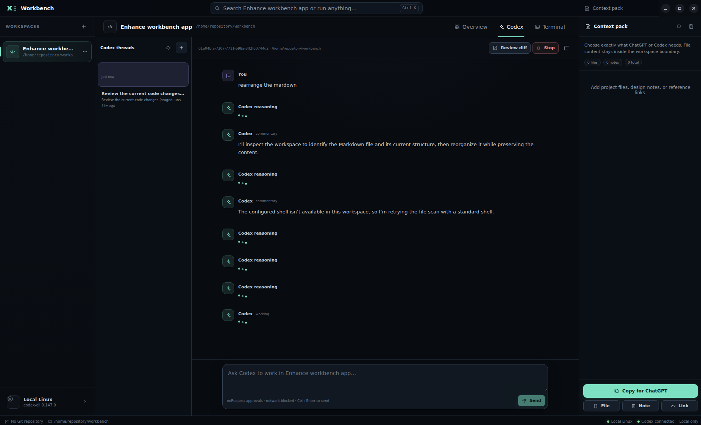
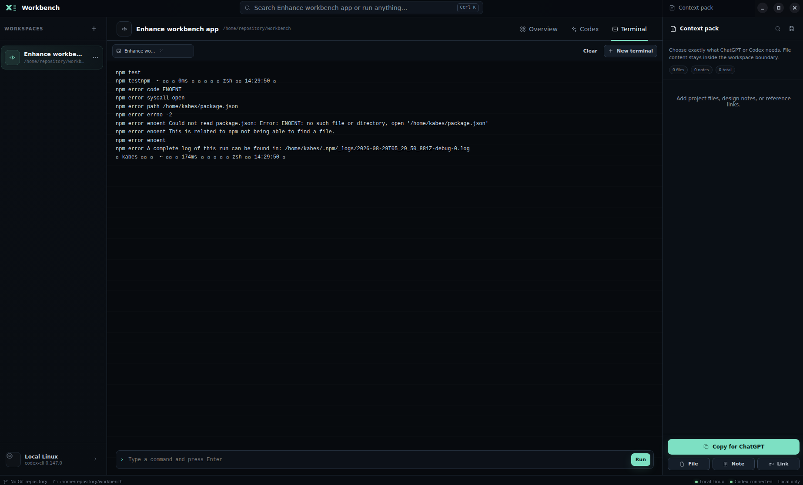

# Workbench Task Board

This is the living prioritized queue. Keep only one primary repair task in progress unless independent work is intentionally parallelized.

States: `pending` · `in progress` · `blocked` · `done`

## Current focus

### P0-001 — Fix critical error

- **State:** done
- **Objective:** To enable this application to start a workspace to enhance oneself.
- **Reported or observed symptom:** ,
- **Acceptance criteria:**
  - [x] This error goes away.
  - [x] We can start a workspace to enhance this app.
  - [x] Doesn't report reasoning status in the log like above.
- **Evidence:** Codex CLI 0.150.1 reproduced JSON-RPC `-32600` for invalid `onRequest` and `workspaceWrite` thread-start values. After boundary serialization was corrected, the same installed app-server created an ephemeral thread in `/home/kabes/repository/workbench`. The renderer now excludes both hydrated reasoning items and streamed `item/reasoning/*` notifications while retaining agent messages; focused regression tests, `npm run check`, the production build, and a bounded Electron launch passed.
- **Hypothesis:** Confirmed root causes: Workbench sent UI/domain spellings unchanged across a Codex app-server boundary whose approval and top-level thread-sandbox values use different wire spellings, and the renderer promoted empty internal reasoning lifecycle items into visible transcript rows.
- **Next action:** P0-002 — GUI enhancement for coding projects.
- **Blocker:** None established.

### P0-002 — GUI enhancement for coding projects

- **State:** done
- **Objective:** To make coding projects user-friendly.
- **Reported or observed symptom:** Hard to use the app.
- **Acceptance criteria:**
  - [x] Model should be selected easily.
  - [x] For a coding project, it should load markdown system and also create such a system by default. And should have a clear and easy slot to write tasks and pop/offer task queues not from markdowns directly but on GUI.
  - [x] Should display the rest usage limit.
  - [x] The task composer supports pasted images, explicit priority, and automatically increasing IDs independent from priority.
  - [x] Tasks can be structurally nested.
- **Evidence:** The installed Codex catalog populates thread-scoped model and reasoning controls, while usage and reset time come from app-server responses and notifications. New workspaces safely initialize the Markdown workflow, and the task composer provides explicit P0–P3 priority, optional parent and acceptance-criteria fields, plus paste/drop/file image previews. Durable locked `WB-NNN` allocation prevents reuse and cross-process collisions; arbitrary legacy heading IDs remain visible and can parent new tasks when unambiguous; parent metadata renders as a semantic tree; bounded PNG/JPEG/WebP files stay under `.workbench/task-images/`; complete PNG image data, JPEG tables/scans, lossy VP8 control/token partitions, VP8L streams, and ordered single WebP alpha payloads are checked before acceptance; compressed PNG/JPEG/WebP work runs outside the Electron main thread; animated WebP frames must fit their declared canvas; workflow and metadata files must resolve inside the workspace as single-link regular files; task reads/appends, locking, sequencing, image writes, and cleanup stay anchored to validated filesystem handles; a committed Markdown append remains a successful add even if its follow-up refresh fails; and duplicate IDs remain visible without exposing an ambiguous Send action. Focused success, failure, concurrency, renderer, launch, strict-check, packaged-runtime, and production-build verification passed.
- **Hypothesis:** Confirmed. Typed app-server metadata plus a fixed-filename, `realpath`-guarded Markdown service provides the requested project UX without broad renderer file access. Flat parent IDs preserve human-editable task records while a derived renderer tree supplies arbitrary nesting; a stable workspace lock, atomic sequence reservation, and stdin-only image writes safely support IDs and attachments.
- **Next action:** P0-004 — Review main/preload/renderer and IPC security.
- **Blocker:** None established.

### P1-004 — GUI bugfix

- **State:** done
- **Objective:** To fix GUI bugs
- **Reported or observed symptom:** Under 150% Windows scaling, WSLg fullscreen did not align with the top edge and mouse hit targets shifted below the visible pointer.
- **Acceptance criteria:**
  - [x] Full screen, a small window can be switched to each other without problem.
  - [x] Model should be determined at the terminal level, not globally.
- **Evidence:** F11 and Escape round-trip native fullscreen through an explicit normal-bounds snapshot. Workbench now also reconciles WSLg's unapplied fractional desktop scale before Electron becomes ready when every reported monitor agrees: on the reported 150% display, both the Windows surface and Electron renderer reached `(0,0) 2560×1440`, seven real pointer clicks retained exact y-coordinates, and the original 900×700 bounds restored. Mixed-scale layouts safely retain Electron defaults. A confirmed runtime scale change offers a restart for recalibration, with a safe **Later** path that does not interrupt active commands or discard drafts unexpectedly. Model/reasoning choices remain keyed by Codex thread and were previously verified with two independent thread settings. The focused scale regression, all 13 test files, strict checks, production build, patched Electron launch, and real Windows-pointer journey passed.
- **Hypothesis:** Confirmed root causes: WSLg exposed a 3840×2160 XWayland display at scale 1 while its Windows RDP surface used 2560×1440 coordinates at 150%, native fullscreen retained fullscreen-sized bounds after exit, the original fixed layout prevented a genuinely small window, and model ownership was persisted at workspace scope.
- **Next action:** Complete P0-002 structured-task delivery, then begin P0-004 — Review main/preload/renderer and IPC security.
- **Blocker:** None established.

## Queue

| Priority | ID | State | Task | Completion evidence |
|---|---|---|---|---|
| P0 | P0-003 | done | Establish a trustworthy automated verification baseline | Correction head passed both push- and pull-request-event workflows: each ran 24 Linux/WSL and 22 portable Windows tests, built NSIS with explicit non-publishing mode, and uploaded an artifact; automated re-review was clean; no lint script is available |
| P0 | P0-004 | pending | Review main/preload/renderer and IPC security | Applicable Electron-security checklist items evidenced or explicitly unavailable; focused tests where practical |
| P1 | P1-001 | pending | Verify terminal and process lifecycle | Applicable terminal checklist items evidenced or explicitly unavailable, including CWD, I/O, cancel, restart, and cleanup |
| P1 | P1-002 | pending | Verify workspace behavior and path handling | Applicable workspace checklist items evidenced or explicitly unavailable, including path boundaries and platform forms |
| P1 | P1-003 | pending | Review Codex integration end to end | Applicable Codex checklist items evidenced or explicitly unavailable, including security and stale-process events |
| P2 | P2-001 | pending | Review and improve core UI/UX | Applicable UI/UX checklist items evidenced or explicitly unavailable across primary, empty, error, keyboard, resize, and reload states |
| P2 | P2-002 | pending | Reconcile setup, user, and architecture documentation | Documentation matches verified behavior, commands, environment, and limitations |
| P2 | P2-003 | done | Add pull-request delivery and automated Copilot reflection workflow | Workflow covers safe synchronization, feature-branch push, PR review, finding disposition, fixes, and automatic re-review |

## New task template

### P?-NNN — Short outcome

- **State:** pending
- **Objective:**
- **Reported or observed symptom:**
- **Scope:**
- **Out of scope:**
- **Acceptance criteria:**
  - [ ]
- **Evidence:**
- **Hypothesis:**
- **Next action:**
- **Blocker:** None established.

## Maintenance rules

- Promote a task to `in progress` only when active work begins.
- Mark it `done` only when every applicable acceptance criterion has evidence.
- If a criterion is unavailable, state why and record the smallest remaining verification.
- Use `blocked` only under the genuine-blocker rules in `AGENTS.md`.
- Split broad discoveries into small outcome-based tasks instead of silently expanding scope.
- Do not use this board as the evidence log; append detailed session evidence to `WORKBENCH_PROGRESS.md`.

### WB-005 — Terminal should be the same format as usual.

- **State:** pending
- **Priority:** P0
- **Objective:** Terminal session in this app is as useful as the normal one.
- **Acceptance criteria:**
  - [ ] - Terminal session suddenly exits with code 124
  - [ ] - Terminal shows collapsed characters, not supporting zsh ui.
  - [ ] - There's a block to send messages but it disable us to choose options displayed in terminal. Should be like the usual terminal block.
